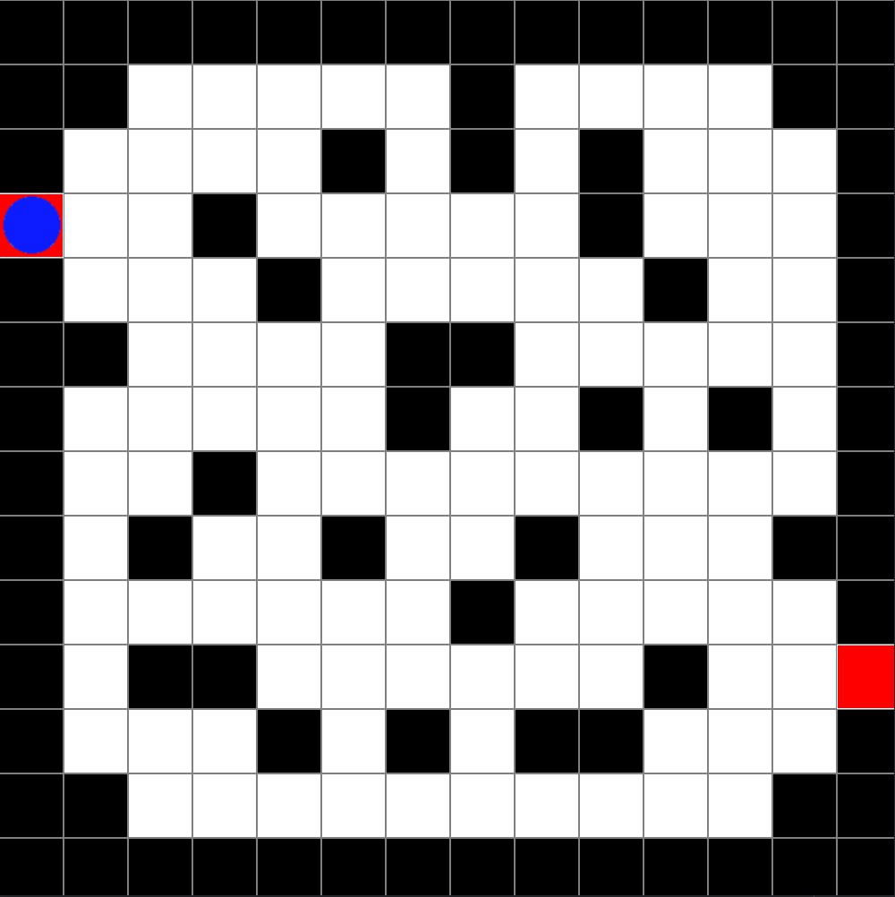

# *Labyrinth Puzzle*

## Description

The Labyrinth Puzzle is a game where the objective is to navigate a blue circle through a labyrinth by only moving forward or to the right. 

>## Starting State

This is the base state of the game:  

>## Final State
> 
This is the final state of the game:  

## Solution

1. FORWARD
2. RIGHT
3. FORWARD
4. RIGHT
5. FORWARD
6. FORWARD
7. FORWARD
8. RIGHT
9. RIGHT
10. FORWARD
11. FORWARD
12. FORWARD
13. FORWARD
14. FORWARD
15. FORWARD
16. RIGHT
17. RIGHT
18. RIGHT
19. FORWARD
20. FORWARD